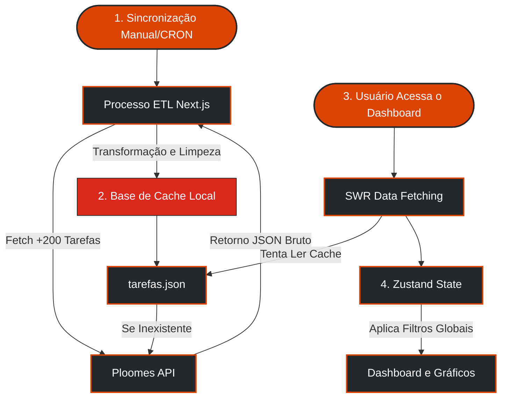

<div align="center">

# <span style="color: #25282a;">Saavedra</span> <span style="color: #dc4405;">Comercial</span>

### 📊 Sistema Corporativo de BI e Gestão Comercial (Integração Ploomes CRM)

<p align="center">
  
  
  
  
  
  
</p>

<p align="center">
  <a href="#-visão-geral"><b>Visão Geral</b></a> &bull;
  <a href="#-arquitetura-e-fluxo-de-dados"><b>Fluxo de Dados</b></a> &bull;
  <a href="#-recursos-e-funcionalidades"><b>Funcionalidades</b></a> &bull;
  <a href="#-telas-da-plataforma"><b>Telas</b></a> &bull;
  <a href="#-instalação-e-execução"><b>Instalação</b></a>
</p>

---

</div>

## 🌐 Visão Geral

O **Saavedra Comercial** é uma plataforma corporativa robusta desenvolvida para unificar, padronizar e monitorar os processos de vendas e atendimento da equipe comercial. 

Projetada especificamente para as operações da **Saavedra**, a ferramenta consome dados em tempo real do **Ploomes CRM** e os transforma em painéis de inteligência (BI), oferecendo visão macro e micro (por vendedor, cliente e temporal) e garantindo conformidade com as metas da equipe.

```text
┌─────────────────────────┐          ┌─────────────────────────┐          ┌───────────────────────────────┐
│      Frontend Web       │  HTTP    │   Next.js API Routes    │  HTTPS   │      Ploomes CRM (API)        │
│  React Server / Client  │ ◄──────► │   Proxy & ETL Engine    │ ◄──────► │   - Contatos & Negócios       │
│  SWR Cache / Recharts   │          │   Geração de JSON Cache │          │   - Tarefas & Agendamentos    │
└─────────────────────────┘          └────────────┬────────────┘          └───────────────────────────────┘
                                                  │
                                                  ▼
                                     ┌─────────────────────────┐
                                     │  Cache Local (Node fs)  │
                                     │  src/data/tarefas.json  │
                                     └─────────────────────────┘
```

---

## 🔄 Arquitetura e Fluxo de Dados

O sistema utiliza um padrão híbrido para contornar limites de requisição (Rate-Limit) da API do Ploomes, garantindo alta velocidade:



---

## ✨ Recursos e Funcionalidades

<table>
  <tr>
    <td width="50%" valign="top">
      <h3 style="color: #dc4405; margin-top: 0;">📊 Dashboards de Performance</h3>
      <ul>
        <li><b>Métricas em Tempo Real:</b> Indicadores de volume total, tarefas concluídas, em aberto e média diária.</li>
        <li><b>Gráficos Interativos:</b> Componentes dinâmicos com <i>Recharts</i> mapeando mapas de atividade por dia, donut de tipos de atendimento e tendência histórica.</li>
        <li><b>Filtros Globais:</b> Filtre instantaneamente toda a plataforma por Período, Vendedor, Cliente, Funil ou Status usando Zustand.</li>
      </ul>
    </td>
    <td width="50%" valign="top">
      <h3 style="color: #da291c; margin-top: 0;">⏱️ Gestão de Gargalos</h3>
      <ul>
        <li><b>Painel de Atrasos:</b> Identificação automática de tarefas que ultrapassaram a data limite estabelecida.</li>
        <li><b>Métrica de Conformidade:</b> Cálculo percentual em tempo real garantindo que os usuários estão vinculando contatos e negócios corretamente.</li>
        <li><b>Sync Google:</b> Indicador e rastreamento de agendamentos espelhados no Google Calendar.</li>
      </ul>
    </td>
  </tr>
  <tr>
    <td width="50%" valign="top">
      <h3 style="color: #25282a; margin-top: 0;">🏢 Detalhamento Profundo</h3>
      <ul>
        <li><b>Raio-X de Clientes:</b> Modal completo listando todas as interações com um cliente específico, com links diretos para abrir o Ploomes.</li>
        <li><b>Ranking de Vendedores:</b> Classificação transparente da força de vendas baseada no volume de execução.</li>
      </ul>
    </td>
    <td width="50%" valign="top">
      <h3 style="color: #0ea5e9; margin-top: 0;">⚡ Alta Performance</h3>
      <ul>
        <li><b>SWR da Vercel:</b> Deduplicação de chamadas, revalidação automática no foco da janela e cache instantâneo de interface.</li>
        <li><b>Leitura Assíncrona:</b> API Routes otimizadas com <code>fs/promises</code> garantindo zero bloqueio da Thread principal do Node.</li>
      </ul>
    </td>
  </tr>
</table>

---

## 🖥️ Telas da Plataforma

* **Dashboard Principal (`/`):** Visão macro da operação.
* **Visão Vendedores (`/vendedores`):** Foco no desempenho individual.
* **Visão Clientes (`/clientes`):** Detalhamento das empresas/contatos que mais demandam esforço comercial.
* **Visão Operacional (`/operacional`):** Controle de qualidade.
* **Visão Temporal (`/temporal`):** Análise de sazonalidade e tendências.
* **Sincronização (`/sincronizacao`):** Painel de controle do processo ETL.

---

## ⚙️ Instalação e Execução

### 1. Pré-requisitos
* **Node.js** (versão 18 ou superior)
* **NPM** ou **Yarn**

### 2. Passo a Passo
```bash
# Clone o Repositório
git clone https://github.com/suportesaav-web/saav-comercial.git

# Entre na pasta
cd saav-comercial

# Instale as dependências
npm install

# Crie o arquivo .env.local e insira a chave do Ploomes
echo "PLOOMES_API_KEY=sua_chave_aqui" > .env.local

# Inicie a aplicação
npm run dev
```

Abra [http://localhost:3000](http://localhost:3000) no seu navegador.

---

<br>

<div align="center" style="margin-top: 40px; padding-top: 20px; border-top: 1px solid #e2e8f0;">
  <p style="color: #94a3b8; font-size: 0.95rem;">Desenvolvido por Jonatan Severo • Saavedra Suporte Web<br>E-mail: suporte.saav@saavedra.com.br<br>Propriedade exclusiva e confidencial da Saavedra. Todos os direitos reservados.</p>
</div>
