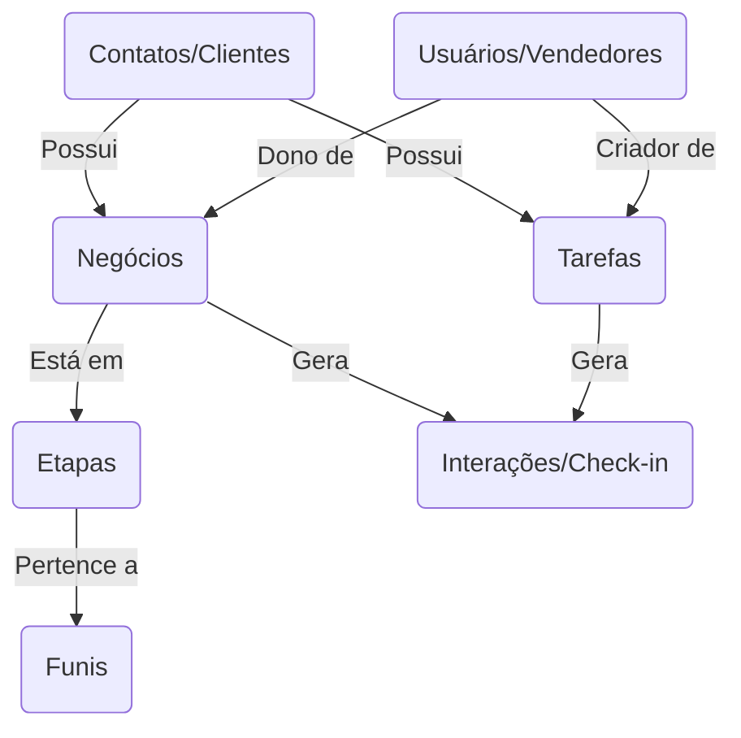

# Auditoria e Mapeamento de Dados - API Ploomes CRM

## 1. Resumo Executivo
Este documento consolida a auditoria técnica de leitura da API oficial do Ploomes CRM (OData API), voltada para a construção e evolução do **saav-dashboard**. O objetivo principal é documentar a estrutura de dados disponível, os relacionamentos entre entidades, a adequação para cálculos de BI (Business Intelligence), e o potencial futuro de cruzamento de dados com o ERP Sankhya. Nenhuma alteração foi realizada na base de dados durante esta análise.

## 2. Estrutura da API
- **Arquitetura**: OData RESTful API (v2.0)
- **Base URL**: `https://api2.ploomes.com/`
- **Autenticação**: Via cabeçalho HTTP (`User-Key`), definida de forma segura e não exposta.
- **Padrões de Consulta (OData)**:
  - `$top` e `$skip`: Utilizados para paginação (ex: buscar lotes de 100 em 100 registros).
  - `$expand`: Utilizado para trazer dados de entidades relacionadas na mesma requisição (ex: carregar detalhes do Vendedor junto com a Tarefa).
  - `$filter`: Utilizado para filtragens complexas.
  - `$orderby`: Utilizado para ordenação (ex: `DateTime desc`).

## 3. Entidades Encontradas e Mapeadas
Durante a auditoria (e pela análise da lógica existente de sincronização local em `tarefas.json` e `interacoes.json`), validamos as principais entidades do funil de vendas.

### 3.1. Entidade: Tarefas (`Tasks`)
Responsável pelas atividades operacionais, compromissos, visitas e lembretes da equipe.
* **Endpoint**: `/Tasks`
* **Identificador**: `Id` (Inteiro)
* **Campos principais**:
  * `Type` / `tipo_tarefa` (Relacionamento/Dimensão)
  * `Title` / `titulo` (Texto/Dimensão)
  * `ContactId` / `nome_cliente` (Relacionamento/Dimensão)
  * `Creator` / `nome_vendedor` (Relacionamento/Dimensão)
  * `DealId` / `titulo_negocio` (Relacionamento/Dimensão)
  * `Finished` / `finalizada` (Status/Fato)
  * `DateTime` / `raw_datetime` (Data)
  * `Length` / `horas` (Numérico/Métrica)
  * `CreatesGoogleCalendarEvent` / `google_sync` (Booleano)

### 3.2. Entidade: Interações (`InteractionRecords`)
Contém o histórico e a comprovação física (check-ins) das atividades.
* **Endpoint**: `/InteractionRecords`
* **Identificador**: `Id` (Inteiro)
* **Campos principais**:
  * `CreateDate` / `raw_datetime` (Data)
  * `Content` / `conteudo` (Texto)
  * `TaskId` / `task_id` (Relacionamento para `Tasks`)
  * `DealId` / `deal_id` (Relacionamento para `Deals`)
  * `ContactId` / `contact_id` (Relacionamento para `Contacts`)
  * `CreatorId` / `vendedor_id` (Relacionamento para `Users`)
  * Campos de GPS: `checkin_lat`, `checkin_lng`, `checkin_validado` (Métricas de Engajamento/Auditoria).

### 3.3. Entidade: Negócios / Oportunidades (`Deals`)
Representa o funil de vendas em si.
* **Endpoint**: `/Deals`
* **Identificador**: `Id` (Inteiro)
* **Campos (Inferidos e documentação padrão)**:
  * `Amount` (Valor Monetário/Fato)
  * `StageId` (Etapa/Dimensão)
  * `PipelineId` (Funil/Dimensão)
  * `StatusId` (Status: Ganho, Perdido, Aberto)

## 4. Relacionamentos do CRM
Os relacionamentos abaixo baseiam-se na estrutura do Ploomes.

## 5. Mapeamento para BI (Business Intelligence)

| Entidade | Campo | Significado | Tipo | Classificação (BI) | Utilidade BI |
|----------|-------|-------------|------|--------------------|--------------|
| Tarefa | `Id` | ID da Tarefa | Numérico | Identificador | Útil para Distinct Count |
| Tarefa | `DateTime` | Data do Evento | Data | Data | Filtros temporais, Séries de Tempo |
| Tarefa | `Length` | Duração da tarefa | Numérico | Métrica | Cálculo de horas totais gastas |
| Tarefa | `Finished` | Finalização | Booleano | Status | Segmentação (Realizado x Pendente) |
| Interação | `checkin_lat/lng`| Coordenadas | Numérico | Métrica | Mapa de calor de visitas e check-ins |
| Negócio | `Amount` | Valor da Oportunidade | Numérico | Fato (Monetário) | Receita esperada, ticket médio |
| Negócio | `StatusId`| Status (Ganho/Perdido) | Numérico | Dimensão | Taxa de Conversão |

## 6. Métricas e KPIs Possíveis

| KPI | Fórmula / Cálculo | Endpoint(s) | Viabilidade Atual |
|-----|-------------------|-------------|-------------------|
| **Produtividade Comercial** | `COUNT(Tarefas)` agrupado por `Creator` (Vendedor) onde `Finished=true` | `/Tasks` | 🟢 Já implementado no app |
| **Taxa de Adoção Mobile** | `(COUNT(Interações com GPS) / COUNT(Tarefas Visita)) * 100` | `/InteractionRecords` | 🟢 Possível diretamente com cache atual |
| **Valor Total em Pipeline** | `SUM(Deals.Amount)` onde `Status = Aberto` | `/Deals` | 🟠 Depende de sincronizar `/Deals` |
| **Taxa de Conversão** | `(Deals Ganhos / Total Deals Resolvidos) * 100` | `/Deals` | 🟠 Depende de sincronizar `/Deals` |
| **Ticket Médio** | `SUM(Deals.Amount) / COUNT(Deals Ganhos)` | `/Deals` | 🟠 Depende de sincronizar `/Deals` |
| **Índice de Atrasos** | `% de Tarefas com DateTime < Hoje e Finished=false` | `/Tasks` | 🟢 Já calculado (`ShameRanking`) |

## 7. Potencial de Cruzamento com Sankhya (ERP)
Para amarrar o CRM (Ploomes) ao ERP (Sankhya), as chaves comuns dependem fortemente de higienização de dados.

| Ploomes (CRM) | Sankhya (ERP) | Possível Chave de Cruzamento | Confiabilidade |
|---------------|---------------|------------------------------|----------------|
| `Contact.CNPJ` | `Parceiro.CGC_CPF` | CNPJ/CPF formatado (apenas números) | Alta ⭐⭐⭐ |
| `Contact.Code` | `Parceiro.CODPARC` | Código externo de ERP salvo no Ploomes | Altíssima ⭐⭐⭐⭐ |
| `User.Email` | `Usuario.EMAIL` | E-mail corporativo | Média ⭐⭐ |
| `Product.Code`| `Produto.CODPROD` | Código de SKU idêntico | Alta ⭐⭐⭐ |
| `Deal.Id` | `Pedido.NUMPEDIDO` | O Sankhya precisa salvar o ID do Negócio | Média (exige dev no ERP) |

> **Aviso de Integração**: Não invente chaves textuais pelo "Nome do Cliente", pois as razões sociais costumam diferir. Utilize estritamente o `CNPJ` ou um campo customizado no Ploomes que guarde o `CODPARC` do Sankhya.

## 8. Limitações e Cuidados
- **Paginação / OData limit**: A API geralmente retorna erro se não usar os tokens OData corretamente em algumas rotas complexas. As requisições suportam um `$top` máximo que precisa ser contornado com laços de `$skip`.
- **Rate Limiting (Throttle)**: É obrigatório adicionar delays (ex: 600ms entre as requisições) em operações de sincronização total (ETL) para não estourar o limite de 120 reqs/min do Ploomes.
- **Estrutura Encadeada**: O uso excessivo de `$expand` (ex: `Users($expand=User)`) pode tornar a requisição lenta e sujeita a timeouts (HTTP 500).

## 9. Recomendações e Próximas Etapas

### 🔴 Alta Prioridade (Dashboard Principal)
- Manter o painel diário focado no funil operacional (Atrasos x Realizações x Em Aberto), que já está alimentado pelos endpoints `/Tasks` e `/InteractionRecords`.

### 🟠 Média Prioridade (Visão Gerencial)
- Criar a sincronização (CRON ou ETL manual) para o endpoint `/Deals`, focando na importação do Pipeline Financeiro para que o BI mostre valores monetários (Ticket Médio e Taxa de Conversão).

### 🟢 Baixa Prioridade (Inovações)
- Adicionar sincronização do endpoint `/Products` para construir gráficos de **Curva ABC de Produtos Cotados** vs **Produtos Vendidos** (podendo cruzar futuramente com o módulo comercial do Sankhya).
